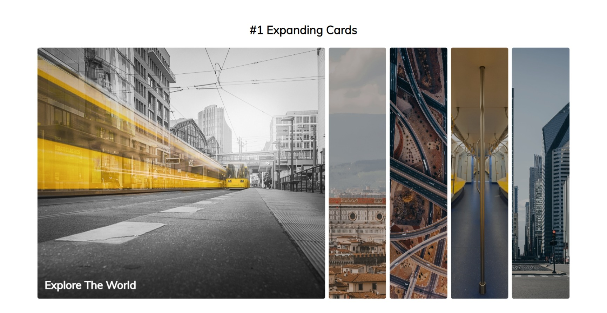

# 50 Projects in 50 Days - HTML, CSS and JavaScript

#### A collection of mini web projects written in plain HTML, CSS and JavaScript.

Based on projects from Brad Traversy and Florin Pop's course: [50 Projects in 50 Days - HTML, CSS, and JavaScript]().

## Project 1 - Expanding Cards

### [Expanding Cards](https://github.com/Abedalrhmanrizk/-1-Expanding-Cards) | [Live Demo](https://abedalrhmanrizk.github.io/-1-Expanding-Cards/)
